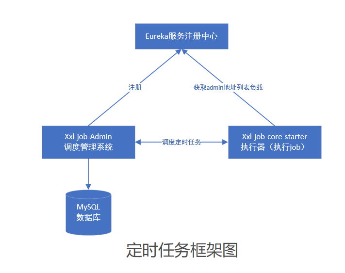

# 定时任务框架（基于xxl-job开源项目进行优化改造）

 

## 一、修改执行器项目xxl-job-core为xxl-job-core-starter，实现以下功能：

1. 基于xxl-job-core进行改造，实现基于eureka获取调度器服务admin，进行负载均衡，默认每30秒拉取eureka中的admin调度服务地址进行更新。
2. 零配置启动定时Job任务（直接引入依赖包，既可以自动starter，具有执行器角色）。

## 二、使用方法：

### 1. 部署后台管理系统（调度管理系统）

调度服务xxl-job-admin是springboot项目，配置好eureka地址，数据库地址，spring.application.name=soa-jobcenter，启动即可。

打开调度后台管理页面localhos:8801，登录账号密码admin/123456

### 2. 部署执行器（参考代码例子项目xxl-job-executor-springboot-jobcenter基于springboot的例子）

1.引入xxl-job-core-starter依赖
  

        <dependency>
             <groupId>com.xuxueli</groupId>
             <artifactId>xxl-job-core-starter</artifactId>
             <version>2.2.0</version>
         </dependency>
         
         
2.配置eureka地址，用于拉取调度器admin服务地址，例如：

     eureka.client.registryFetchIntervalSeconds=5
     eureka.client.serviceUrl.defaultZone = http://10.2.X.X:8088/si-eureka/eureka/
     eureka.instance.hostname=${spring.application.name}
     register-with-eureka: false
     eureka.instance.prefer-ip-address=true 
     eureka.instance.instance-id=${spring.application.name}:${spring.cloud.client.ip-address}:${spring.application.instance_id:${server.port}}
     eureka.instance.lease-expiration-duration-in-seconds=15
     eureka.instance.lease-renewal-interval-in-seconds=5

 3.编写定时任务：

@Component标注类加入spring容器

@XxlJob("demoJobHandler")标注方法并带名字，一个方法等于一个定时任务 

     @Component
     public class DemoJobHandler {
          /**
          * 1、简单任务示例（Bean模式）
          */
          
         @XxlJob("demoJobHandler")
         public ReturnT<String> demoJobHandler(String param) throws Exception {
             XxlJobLogger.log("XXL-JOB, Hello World.");
     
             for (int i = 0; i < 5; i++) {
                 XxlJobLogger.log("beat at:" + i);
                 TimeUnit.SECONDS.sleep(2);
             }
             return ReturnT.SUCCESS;
         }
     }